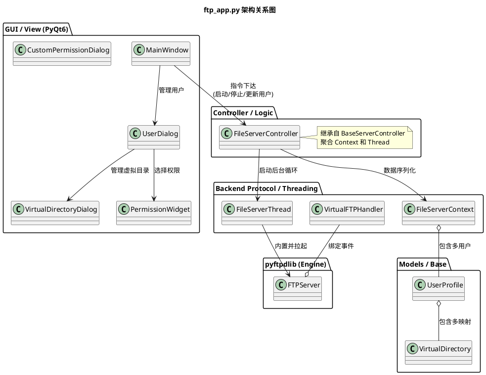
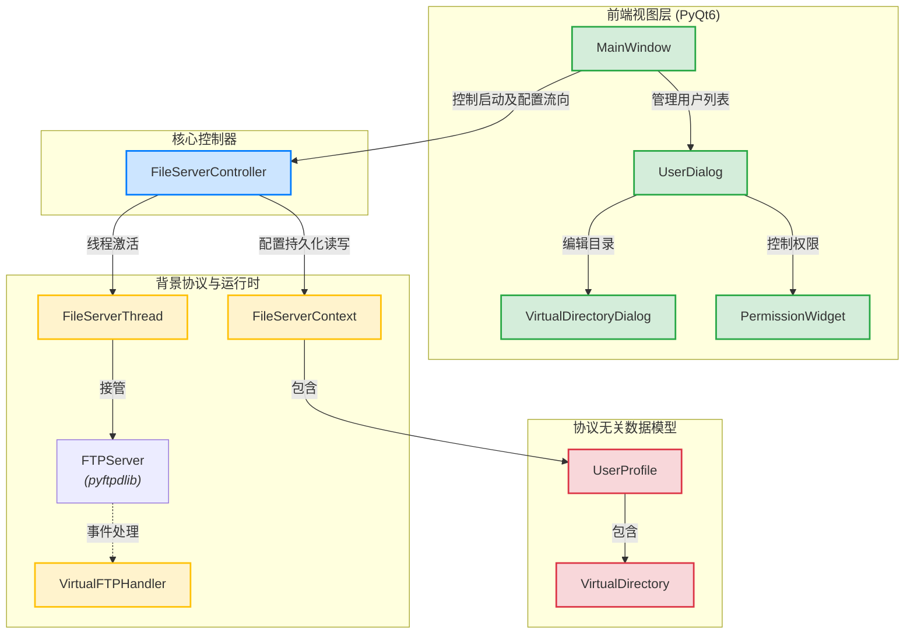

# ftp_app.py 项目分析报告

## 1. 项目层次 (Project Hierarchy)
`ftp_app.py` 位于 `Castle/beta/server_proj` 目录下。该目录下主要包含了以下核心文件，可以清晰地看出项目的多模块拆分架构：

- **业务模块**：
  - `ftp_app.py`: 本文分析的目标，作为基于 PyQt6 封装的 FTP 服务器管理主应用，包含了 FTP 专用扩展以及图形界面逻辑。
  - `flask_app.py`: 另一个并行的基于 Flask 的 Web 服务应用端。
- **公共基类和模型抽象**：
  - `server_base.py`: GUI 和后台服务管理的通用基类框架（包含了 `BaseServerContext`/`BaseServerThread`/`BaseServerController` 提供通用服务）。
  - `file_server_model.py`: 文件服务器领域的对象定义集合，如用户配置（`UserProfile`）、虚拟目录抽象（`VirtualDirectory`），在最近的重构中为实现协议无关化而抽取出来的抽象模块。
  - `file_server_backend.py`: 多协议后端系统（可以支持 FTP、FTPS、SFTP 等协议的不同具体实现）。
- **配置与数据**：
  - `ftp_users.json`: 用户鉴权及虚拟目录配置信息的序列化存储位置。
  - `flask_config.json`: Web 服务配置文件。
- **其他资源**：
  - `doc/`: 相关的项目技术文档。
  - `root/`: 默认的 FTP 服务器根目录挂载点。

---

## 2. 依赖关系 (Dependencies)
`ftp_app.py` 根据其功能引入了非常多的依赖，主要分为以下四大类：

### 2.1 标准库
- `sys`, `os`, `re`, `ctypes`: 用于底层系统路径检查、控制台窗口显隐等 API 调用。
- `logging`, `datetime`: 用于日志组件输出时间格式设定。
- `signal`, `atexit`: 用于跨平台的退出清理和安全回收释放端口。
- `typing` (`Dict`, `Any`, `List`, `Optional`, `Tuple`): 类型注解增强。

### 2.2 第三方库
- **PyQt6**: 提供核心的 GUI 用户交互层
  - `QtWidgets`: 诸如 `QMainWindow`, `QTableWidget`, `QDialog`, `QLineEdit`, `QVBoxLayout` 等丰富控件。
  - `QtCore`, `QtGui`: Qt 底层架构以及图标颜色渲染。
- **pyftpdlib**: 提供 FTP 核心异步协议栈
  - `pyftpdlib.authorizers.DummyAuthorizer`
  - `pyftpdlib.handlers.FTPHandler`
  - `pyftpdlib.servers.FTPServer`
  - `pyftpdlib.filesystems.AbstractedFS`

### 2.3 内部模块依赖
- **领域数据模型** (`file_server_model.py`): 导入了 `VirtualDirectory`，`UserProfile`，`FilePermission` 等用户配置结构。
- **服务基类框架** (`server_base.py`): 继承调用了控制器及多线程封装（`BaseServerContext`, `BaseServerController`, `BaseServerThread`）。

---

## 3. 项目图示 (Project Diagrams)

这里分别使用 PlantUML 和 Mermaid 两种风格描绘 `ftp_app.py` 中的模块交互和层次结构：

### 3.1 PlantUML 版架构图
支持在 JetBrains系列 IDE 等环境通过 PlantUML 插件渲染：

### 3.2 Mermaid 版架构图
支持在 GitHub 仓库、Obsidian、Notion 等多种原生支持 Mermaid 的渲染器中查看：

---

## 4. 代码大纲和功能模块拆解 (Outline)
本文件全长约 2300 行左右，采用经典的 **UI/Controller/Framework分离** 原则。大纲概览如下：

### 3.1 日志与辅助配置
- `LimitedMemoryHandler`: 自定义日志处理器，限制列表最大行数避免长时间挂机导致的 GUI 内存泄漏危机。
- `UISize`: 以类常量的形式统一管理各个页面窗口高宽距。
- `PERMISSION_PRESETS` & `PERMISSION_CATEGORIES`: 管理只读、上传、读写等常见 FTP 预设权限常量的硬编码。
- `is_console_visible`, `hide_console`, `show_console`: Window 操作系统底层 API 挂载的控制台显/隐切换开关。

### 3.2 抽象文件系统覆写层 (`VirtualFS`)
**继承自 `pyftpdlib.filesystems.AbstractedFS`，最核心的复杂逻辑层。**
- `__init__`, `_try_load_user_profile`: 捕获客户端登录信号映射特定配置。
- `ftp2fs` / `fs2ftp`: 将 `FTP虚拟路径` => `系统真实路径` 的双向桥接拦截函数，并过滤 `../` 等路径穿越攻击（Path Traversal Attack），其中重点通过重写 `_resolve_virtual_in_root` 实现所有非根物理路径映射成看似根下目录结构。
- 覆写核心文件操作 (`validpath`, `listdir`, `getsize`, `realpath`, `open`, `chdir`, `mkdir`, `rmdir`): 在基类 FTP OS 层面上注入越权拦截机制与符号链接跳出逃逸验证。

### 3.3 自定义鉴权及事件驱动
- `VirtualDirAuthorizer` (继承自 `DummyAuthorizer`): 实现对于子级"虚拟目录"做单独高低权限分离管理的断言验证（`has_perm`）。
- `VirtualFTPHandler` (继承自 `FTPHandler`): 核心事件处理扩展（在用户登录 `on_login` 时绑定虚拟路径结构）。

### 3.4 后台线程与业务逻辑控制器 (MVC - Controller)
- `FtpServerContext`: 将所有内存的用户配置转录成字典序列化映射存入 `ftp_users.json`，是控制层的抽象介质。
- `FtpServerThread`: **后台守护线程**，重载自 `BaseServerThread`，解决 GUI 程序不能使用事件抢占式循环的问题，其承载运行 `FTPServer.serve_forever`。
- `FtpServerController`: UI 交互层所能触碰到的核心门面控制器，包含 `add_user`, `delete_user`, `reload_config` 的安全触发等。

### 3.5 可复用 PyQt 自定义组件封装
- `CustomPermissionDialog`: 权限高光精调弹窗，分为只读、写、附加项多勾选列。
- `PermissionWidget`: 下拉通用权限块封装选择器，带中文汉化提示。
- `DragDropLineEdit`: 针对路径输入需求封装了针对系统文件拖放操作捕获的特性（重写 `dropEvent`）。

### 3.6 GUI 对话框界面实体 (MVC - View)
- `VirtualDirectoryDialog`: 添加或编辑用户自定义虚拟目录映射的核心窗口。
- `UserDialog`: 管理主面板列表单独用户对象的表单视图（账号、根路径、以及内置虚拟目录表单控制）。
- `MainWindow`: 最核心的运行中枢，实现如下特性：
  - `start`/`stop` 服务器总开关触发。
  - 用户表结构刷新 (`refresh_table`) 及托盘最小化能力 (`setup_tray_icon`, `show_from_tray`)。
  - 接管生命周期以及信号 (`handle_signal`, `_cleanup_on_exit`) 安全关闭进程。

### 3.7 全局生命周期与启动 (Entry)
- `setup_signal_handlers`: 绑定捕捉系统的 Ctrl+C (`SIGINT`/`SIGTERM`) 实现程序的平滑启停。
- `main`: 程序的初始化接管节点，分配全局级别的崩溃抛出错误弹窗处理机制 (`exception_hook`)。
